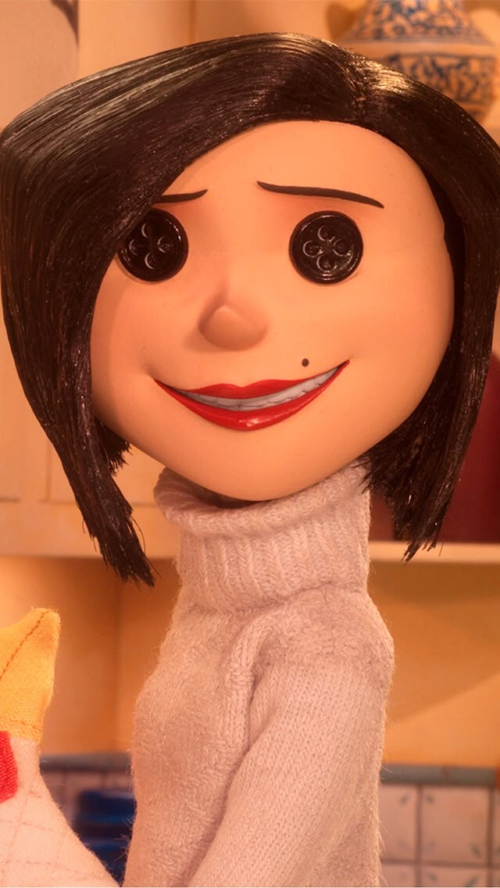
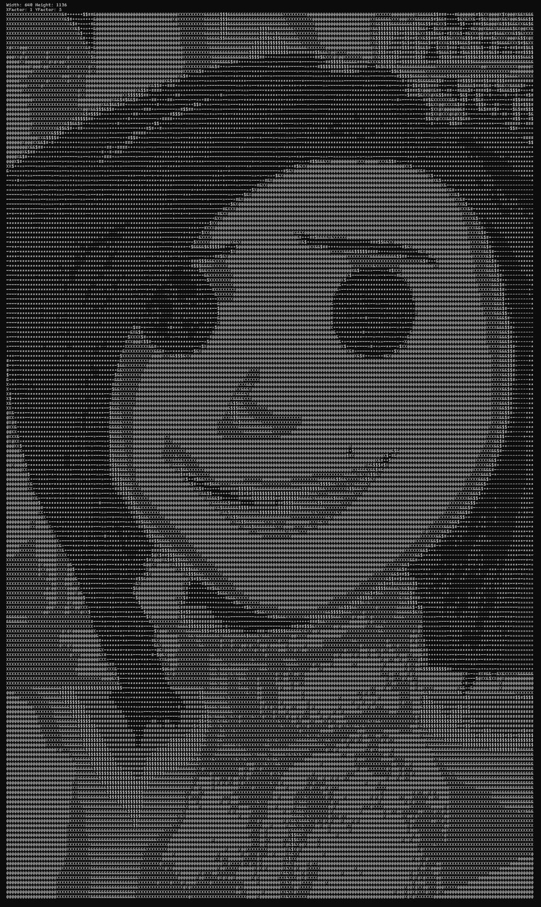

# ASCII-art-generator

## Prerequisites for the device:

<p>The following are expected in the system: </p>

* An instance of MinGW installed in the system (The msys64 installation recommended)
* CMake installed in the system (This project uses version 4.3.1)
* Windows (.bat files used here)

## To run the project (these steps are to run it in powershell):

* To build the project:

```shell
.\build.bat
```

* To run the project:

```shell
.\run.bat 'image\img.jpg'
```

# INPUT



# OUTPUT (Am yet to fix the Hue part of the image so there's no colors yet but I may add it in the future)



# VID DEMO

https://github.com/user-attachments/assets/a55961b4-8f42-4df8-bbc7-a489afd5466b
